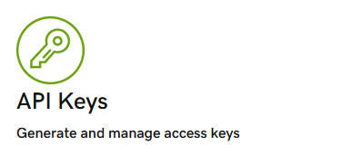
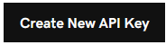
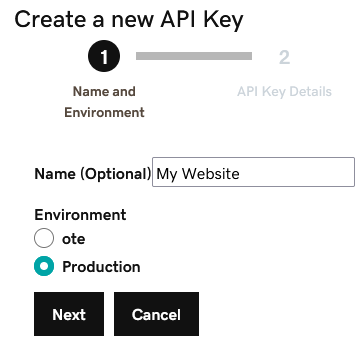
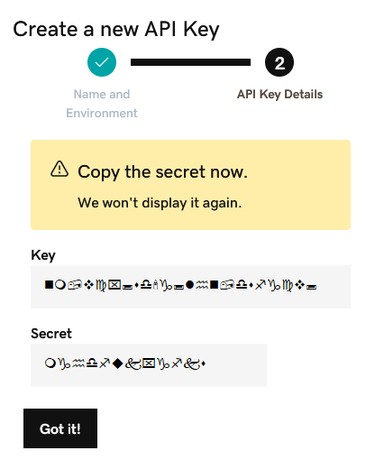
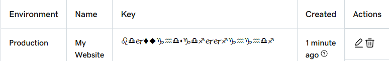
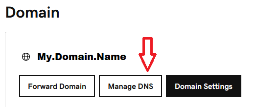
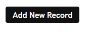
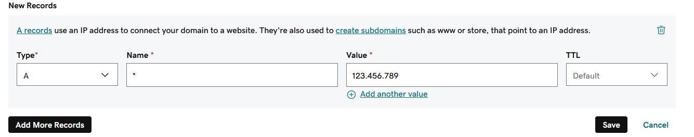
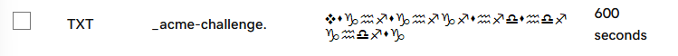

# RHEL8-Certbot-Apache-GoDaddy-DNS-01

 ## Getting Started

Recently I was building a website for someone, and they were using GoDaddy as their DNS provider.  They wanted to use a wildcard for their SSL, for reasons. I originally set them up with the HTTP-01 Challenge, but they didn't want port 80 to be open.  I tried convincing them of using a pfsense to do a reverse proxy and let it handle the SSL.  It was more work than they wanted to deal with, so I accepted the challenge, after all how different is it from cloudflare.  I spent much longer on this than I wanted. This is my research bundled up.
<br />
<br />
I could always use the help. So, please…without hesitation, give me feedback.  More important, give me the best practice. I have no qualms with people showing and telling me how to better my limited knowledge.
<br />
<br />
Quote by Ram Dass: (or << Backtrack)<br /> 
“The quieter you become, the more you can hear.”

## Dependencies
<p style="color:red;"><b>Using Red Hat DISA-STIG security profile</b></p>
Keep in mind of Internal and External DNS and rules on your routers\firewalls, assuming you want this to be public.
Also note that the versions may be different, based on when you install
<ul>
    <li>Red Hat Enterprise Linux 8.8 (Ootpa)</li>
    <li>Apache/2.4.37 (Red Hat Enterprise Linux)</li>
    <li>certbot 1.22.0</li>
</ul>

## GoDaddy Settings

The first thing you need to do is log into your account on GoDaddy and goto the developer section.
https://developer.godaddy.com/
<p align="center">
  
</p>
</br>
Now create a new API Key
<p align="center">
  
</p>
</br>
Give it a distiguishing name and choose "Production", then "NEXT"
<p align="center">
  
</p>
</br>
Now a new window will open giving you a "KEY" and "SECRET".  Make sure you keep it somewhere safe. Hit Got it
<p align="center">
  
</p>
</br>
You should be back to where you started.
<p align="center">
  
</p>
</br>
Now go to the DNS section
<p align="center">
  
</p>
</br>
Add a new record
<p align="center">
  
</p>
</br>
Since we are trying to create a wild card we are going to use an asterisk.  The IP is on you, where ever you public IP is.
You can do this for actual names, just change the asterisk to a name, you do not need the domain name, GoDaddy will do it for you. Then hit Save, we are done with GoDaddy
<p align="center">
  
</p>
</br>

## Script Info

Cerbot has 3 ways of handling SSL Certs by proving you have control over the domain.

1.  `HTTP-01` challenge: This challenge asks you to prove that you control the HTTP service for the domain in question. You do this by placing a specific file with a specific name and content in the `.well-known/acme-challenge/` directory of your website. In general, most people use the HTTP-01 challenge because it's straightforward and can be easily automated with the Certbot tool, provided that port 80 is open to the internet.
    
2.  `DNS-01` challenge: This challenge asks you to prove that you control the DNS for your domain. You do this by placing a specific DNS TXT record in your domain's DNS settings.
    
3.  `TLS-ALPN-01` challenge: This is a less common method that involves responding to TLS connections for your domain in a specific way. This method is not used as often due to its more complex requirements.

In our case I will be using DNS-01 challenge, because I do not want to have port 80 open.
Because Certbot\letsencrypt does not have a native script to handle DNS-01 challenge (at least one I couldn't find).  We will need to create our own script.

There will be 2 scripts to run:

1. `api_create.sh`:  This script uses the API call to GoDaddy's DNS and creates the record based on your domain name.

2. `api_remove.sh`:  This script uses the API call to GoDaddy's DNS and removes the DNS TXT record after verified.  It's recommended to remove the TXT entry after validation and not reuse the same entry when renewing:

 - Security: By removing the TXT record after validation, you minimize the exposure of the sensitive information contained in the record. The longer the record remains in your DNS configuration, the more time it provides for potential attackers to potentially exploit it.
    
 - Change Control: Removing the record ensures that your DNS configuration is always up to date and accurate. Over time, your DNS configuration might change, and reusing the same TXT entry may conflict with existing or future records. By removing the record after validation, you avoid potential conflicts and maintain proper change control practices.
    
 - Reliability: DNS propagation can take time, and it's possible that different DNS resolvers or caching systems may still have the old TXT record cached even after its removal. Reusing the same TXT entry during renewal could lead to issues if the old record is still present in some DNS caches.


### api_create.sh and api_remove.sh

These Bash script is for the DNS-01 challenge verification using the GoDaddy API in conjunction with Certbot, a client for the Let's Encrypt Certificate Authority. This method is to prove you control the DNS for your domain name by putting a specific value in a TXT record for that domain.

This script is to interact with the GoDaddy API to create and delete a DNS TXT record for a particular domain.

Let's break down each part:

`set -e`: This command is short for set -o errexit, which will cause the shell to exit if any invoked command fails (i.e., exits with a non-zero status). By default, bash will continue to execute the next command even if a command fails. The set -e option changes this behavior, turning any individual command failure into an immediate script failure. This is particularly useful in scripts where the success of the whole script is dependent on each individual command running successfully. It helps catch errors and issues early and prevents further execution that could lead to unwanted states or damage.

`set -u`: This command is short for set -o nounset. If you try to use an unset variable, bash will treat it as a null variable by default. However, with set -u, bash will treat any attempt to use an unset variable as an error, and the script will immediately exit. This is useful in avoiding bugs that can occur from using an unset variable, which by default would be a null or empty string. With set -u, you'll know immediately if a variable isn't set, instead of having to debug odd behavior caused by an unexpected null value.

`set -o pipefail`: Normally, a pipeline (i.e., command1 | command2 | command3) will return the exit status of the last command. This means if command1 or command2 fail but command3 succeeds, the whole pipeline is considered to have succeeded. However, when you use set -o pipefail, the pipeline will return the status of the last command that exited with a non-zero status (i.e., failed), or zero if all commands exited successfully. This ensures that you can't ignore errors in any part of the pipeline, making the script more robust and error-prone.

`export PATH="/usr/bin:/bin"`: This sets the PATH environment variable, which determines where the system looks for executable files. It's setting the PATH to just two directories, /usr/bin and /bin. This might be done for security reasons, to limit where the script can execute programs from.

`GODADDY_API_KEY="ENTER KEY" and GODADDY_API_SECRET="ENTER SECRET"`: These lines set up variables for the GoDaddy API key and secret, which you should replace with your actual key and secret.

`DOMAIN=$(expr match "$CERTBOT_DOMAIN" '\(.*\)\..*\..*$')`: This line uses the expr command to extract the base domain from a subdomain (CERTBOT_DOMAIN). This is useful when you're dealing with subdomains, as you need the base domain for the API call.  This is because GoDaddy automatically adds the domain name.  If this was not here the entry to the DNS would be something like "*.mydomain.com.mydoamin.com"

`curl`: This command sends a DELETE request to the GoDaddy API to delete a DNS TXT record for the domain. The URL and the -H option with the Authorization header are constructed using the previously defined variables.

`TMPFILE=$(mktemp)`: This creates a new temp file in a safe manner and stores its name into a variable named TMPFILE.

`GODADDY_API_KEY and GODADDY_API_SECRET`: These are placeholders for your GoDaddy API Key and Secret, which you need to fill in.

`DOMAIN`: this variable is set to a subdomain parsed from $CERTBOT_DOMAIN.

`curl -X PUT`: This command sends a PUT request to the GoDaddy API to create a DNS TXT record for the subdomain. The TXT record will contain the value in $CERTBOT_VALIDATION and will have a time to live (TTL) of 600 seconds (10 minutes).

`sleep 120`: This makes the script wait for 2 minutes to allow the propagation of DNS.

`rm -f $TMPFILE`: deletes the temporary file created earlier in the script.

### Now to pull it together:
```
certbot certonly --manual --preferred-challenges=dns \
--manual-auth-hook /opt/scripts/api_create.sh \
--manual-cleanup-hook /opt/scripts/api_remove.sh \
--non-interactive --agree-tos --email admin@mydomainname.com \
-d *.mydomainname.com
```


`certbot certonly`: This is the command to run Certbot, a tool for obtaining SSL/TLS certificates.

`--manual`: This flag tells Certbot to use manual mode, which requires you to manually perform certain steps to prove ownership of the domain.

`--preferred-challenges=dns`: This flag specifies that the preferred method for verifying domain ownership is through DNS (Domain Name System) (DNS-01) challenges. This means you will need to make DNS changes to prove ownership.

`--manual-auth-hook /opt/scripts/api_create.sh`: This flag specifies a script (`api_create.sh`) to be executed before the validation process. This script is responsible for performing any necessary actions to prove ownership of the domain, such as modifying DNS records.

`--manual-cleanup-hook /opt/scripts/api_remove.sh`: This flag specifies a script (`api_remove.sh`) to be executed after the certificate has been obtained. This script is responsible for undoing any changes made during the authentication process, restoring the DNS configuration to its original state.

`--non-interactive`: This flag instructs Certbot to run in non-interactive mode, which means it will not prompt for user input and will use default values whenever possible.

`--agree-tos`: This flag indicates that you agree to the terms of service.

`--email admin@mydomainname.com`: This flag specifies the email address to be associated with the certificate. This email may be used for important notifications related to the certificate.

`-d *.mydomainname.com`: This flag specifies the domain name for which you want to obtain the certificate. In this case, it is `*.mydomainname.com`.

## Renew Cert with CRON Jobs

When Certbot creates a certificate for the first time, it saves all the options used to create that certificate in a configuration file stored in `/etc/letsencrypt/renewal/`. This includes things like the authenticator used, the installer used, any hooks that were set, etc. This configuration is then used when you run `certbot renew` to attempt to renew the certificate.
If you go into the directory `/etc/letsencrypt/renewal/` you should see a conf file with your domain name.
In this file it will have all the nessesary variables to answer to the renewal command

Basic renwal
```
30 2 * * * /usr/bin/certbot renew --quiet --post-hook "systemctl reload httpd"
```

Renewal with email alerts (make sure you setup mail)
```
30 2 * * * /usr/bin/certbot renew --quiet --post-hook "systemctl reload httpd" || echo "Certbot renewal failed" | mail -s "Certbot renewal failed" admin@mydomainname.com
```

`30 2 * * *` specifies the time to run the command (2:30 am).

`/usr/bin/certbot renew --quiet` is the command to run. The `--quiet` option tells Certbot not to produce any output.

`--post-hook "systemctl reload httpd"` tells Certbot to reload the Apache service after a successful renewal.


## Troubleshoot

If you have some issues, you can piece meal the script:

```
certbot certonly --manual --preferred-challenges=dns \
--manual-auth-hook /opt/scripts/api_create.sh \
--non-interactive --agree-tos --email my#email.com \
-d website.mydomain.com
```
By doing this, you will be able to log into GoDaddy and see if the TXT entry was created.  
<p align="center">
  
</p>
</br>
If you see it, it means things are working, if not, well...